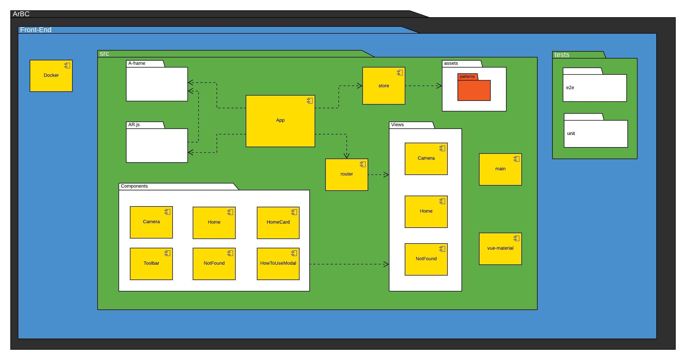
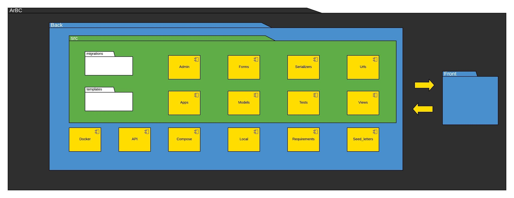
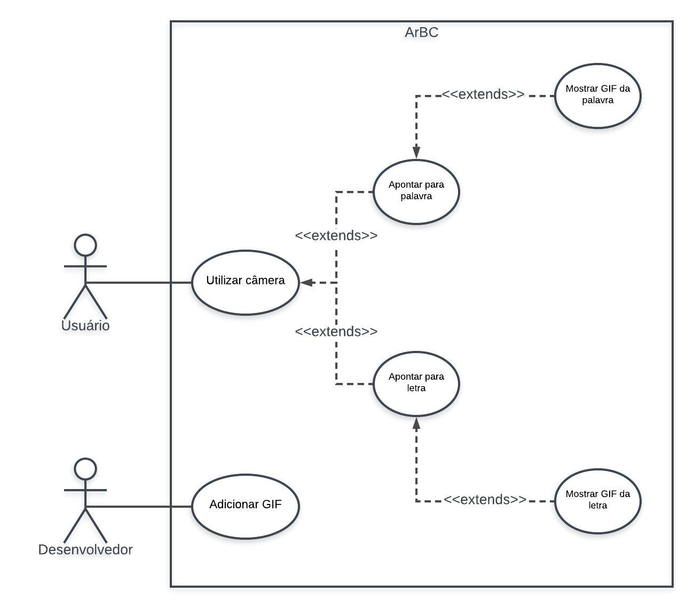

# Histórico de Versões

Data|Versão|Descrição|Autor
-|-|-|-
04/09|1.0.0|Adição do Template do Documento| João Lucas|
07/09|1.1.0|Adição do item 4| Marcelo Victor|
07/09|1.1.1|Melhorias no item 4.1 | Sérgio Cipriano|
07/09|1.2.0|Adição do item 1, 3, 5, 6 e 7| Igor Batista|
07/09|1.3.0|Adição do item 2| Rhuan Carlos|
28/09|1.3.1|Correções links| Sérgio Cipriano|
28/09|1.4.0|Adição do item 2.4| Sérgio Cipriano, Rhuan Carlos, Marcelo Victor|
30/09|1.4.1|Correção link #7 e #6| Sérgio Cipriano|
01/10|1.4.2|Correção das tabelas nos subtópicos 1.3, 2.1, 2.2, 4.2 e 4.3| Sérgio Cipriano, Rhuan Carlos, Marcelo Victor, Igor Batista, João Henrique, Thiago Santos|
02/10|1.5.0|Atualizando subtópico 1.1, 1.2 | Rhuan Carlos|
02/10|1.5.1|Refatoração do subtópico 1.5 | Marcelo Victor|
02/10|2.0.0|Refatoração do Documento de Arquitetura | Thiago Santos|
25/11|2.0.1|Alteração link do diagrama de caso de uso | Sérgio Cipriano e Marcelo Victor|
25/11|3.0.0|Reformulação e Fragmentação do Diagrama de Pacotes | Sérgio Cipriano e Marcelo Victor|
25/11|3.0.1|Correções de texto e erros ortográficos | Sérgio Cipriano e Marcelo Victor|

# Sumário

 1. [Introdução](#1)
  - 1.1 [Finalidade](#1_1)
  - 1.2 [Escopo](#1_2)
  - 1.3 [Definições, Acrônimos e Abreviações](#1_3)
  - 1.4 [Referências](#1_4)
  - 1.5 [Visão Geral](#1_5)
 2. [Representação da Arquitetura](#2)
  - 2.1 [Front-end](#2_1)
  - 2.2 [Back-end](#2_2)
  - 2.3 [Diagrama de Relações](#2_3)
  - 2.4 [Diagrama de Pacotes do Front](#2_4)
  - 2.5 [Diagrama de Pacotes da Back](#2_5)
 3. [Metas e Restrições de Arquitetura](#3)
  - 3.1 [Metas](#3_1)
  - 3.2 [Restrições](#3_2)
 4. [Visão dos Casos de Uso](#4)
  - 4.1 [Diagrama de Casos de Uso](#4_1)
  - 4.2 [Atores de Casos de Uso](#4_2)
  - 4.3 [Descrições de Casos de Uso](#4_3)
 5. [Visão Lógica](#5)
 6. [Tamanho e Desempenho](#6)
 7. [Qualidade](#7)

Documento de Arquitetura de Software
------------------------------------

### 1. <a name="1">Introdução</a>

### 1.1 <a name="1_1">Finalidade</a>

 
 &emsp;&emsp; Este documento tem como finalidade fornecer uma visão geral da arquitetura do ArBC, utilizando-se de diversas visões arquiteturais - tais como a visão lógica e de caso de uso - a fim de facilitar o entendimento dos processos e funcionamento de todo o sistema. Tem também como objetivo transmitir as decisões arquiteturais significativas tomadas em relação ao mesmo.

### 1.2 <a name="1_2">Escopo</a>

 &emsp;&emsp; Atráves desse documento, é possível obter um melhor entendimento da arquitetura do
 projeto permitir ao leitor a compreensão do funcionamento do sistema, como também as abordagens utilizadas para o
 seu desenvolvimento

### 1.3 <a name="1_3">Definições, Acrônimos e Abreviações</a>

Abreviação|Significado
|:-:|:-|
|**MDS**| Métodos de Desenvolvimento de Software|
|**EPS**| Engenharia de Produto de Software|
|**MVT**| *Model View Template*|
|**PWA**| *Progressive Web App*|

### 1.4 <a name="1_4">Referências</a>

Vuex.vuejs.org. Disponível em: https://vuex.vuejs.org. Acesso em: 7 set. 2019.

Vuejs.org. Disponível em: https://vuejs.org/. Acesso em: 7 set. 2019.

PAIVA, Igor; PAULINO, João; VICTOR, Marcelo;  QUEIROZ, Rhuan;  CIRRIANO, Sérgio; SANTOS, Thiago. ArBC: Documento de Arquitetura. Disponível em: https://github.com/fga-eps-mds/2019.2-ArBC/blob/develop/docs/mds/Documento_de_arquitetura.md. Acesso em: 7 set. 2019.

MUNIZ, Amanda; RIOS, Calebe; LIMA, Eduardo; DUARTE, Indiara; RIBEIRO Luciana; TAIRA, Luís; GOUVEIA, Micaella; BUTERS, Samuel; PATROCÍNIO, Sofia. Gaia: Documento de Arquitetura. Disponível em: https://fga-eps-mds.github.io/2019.1-Gaia/#/projeto/DocArquiteturaAcesso. em: 10 out. 2019.

DJORKAEFF, Alexandre; BEZERRA, Davi; DE LYRA, Guilherme; BRANDÃO, Guilherme; REIS, João. Reabilitação Motora: Documento de Visão. Disponível em: https://github.com/fga-eps-mds/2018.1-Reabilitacao-Motora/blob/development/docs/wiki/Documento-de-Arquitetura.md. Acesso em: 7 set. 2019.

### 1.5 <a name="1_5">Visão Geral</a>

 &emsp;&emsp; Este documento é dividido em 7 tópicos, descrevendo os detalhes das características do software proposto.
Sendo dividido em:

* Introdução: Fornece uma visão geral do documento inteiro;
* Representação da arquitetura: Descreve qual é a arquitetura de software do sistema atual e como ela é representada;
* Metas e restrições da arquitetura: Descreve os requisitos e objetivos do software que têm algum impacto sobre a arquitetura;
* Visão de caso de uso: Descreve as partes significativas do ponto de vista da arquitetura do modelo de casos de uso;
* Visão Lógica: Descreve as partes significativas do ponto de vista da arquitetura do modelo de design;
* Tamanho e Desempenho: descreve as principais características de dimensionamento do software que têm um impacto na arquitetura, bem como as restrições do desempenho desejado;
* Qualidade: descreve como a arquitetura do software contribui para todos os recursos (exceto a funcionalidade) do sistema.

## 2. <a name="2">Representação da Arquitetura</a>

### 2.1 <a name="2_1">Front-end</a>

A arquitetura adotada para o <i>front-end</i> é o padrão <i>Vuex</i> que é um <i>state management
 pattern</i>, e consiste em <i>State</i>, <i>View</i> e <i>Actions</i>, cada uma com suas respectivas funções:

 Camada|Função
|:-:|:-|
|*State*| A fonte dos dados locais da aplicação.
|*Mutations*| Um mapa do estado atual.
|*Actions*| As diferentes maneiras de mutar o estado em reação ao usuário.

 
O <i>Vue.js</i> adota em sua própria maneira o modelo acima, substituindo a <i>View</i> por <i> Vue
  Components</i> e, além disso, insere as <i>Mutations</i> que de maneira geral alteram o estado.
 

### 2.2 <a name="2_2">Back-end</a>

A arquitetura adotada para o <i>back-end</i> é o <i>MVT</i>, onde suas respectivas funções podem ser definidas por:

 Camada|Função
 |:-|:-|
 |*Model*| A camada que interage com o bando de dados.
 |*View*| A camada que interage com o *template* e com a *model*.
 |*Template*| A camada de renderização da página.

### 2.3 <a name="2_3">Diagrama de Relações</a>

### 2.4 <a name="2_4">Diagrama de Pacotes do Front</a>

### 2.4 <a name="2_4">Diagrama de Pacotes do Back</a>

## 3. <a name="3">Metas e Restrições de Arquitetura</a>

### 3.1 <a name="3_1">Metas</a>

O sistema deve ter acesso a uma câmera, que quando apontada à uma palavra, mostrará uma imagem referente a ela. O objetivo é auxiliar na alfabetização de crianças.

### 3.2 <a name="3_2">Restrições</a>

A aplicação irá ser executada num navegador e a interface gráfica desenvolvida com <i>HTML</i> e <i>CSS</i>, utilizando o <i>Vue.js</i>. A linguagem de programação usada na implementação do <i>front-end</i> é o <i>JavaScript</i> e no <i>back-end</i> é o <i>Python.</i> 

Por ser uma <i>PWA</i>, a aplicação poderá ser utilizada em qualquer dispositivo móvel com um navegador e uma câmera.

## 4. <a name="4">Visão dos Casos de Uso</a>

### 4.1 <a name="4_1">Diagrama de Casos de Uso</a>

### 4.2 <a name="4_2">Atores de Casos de Uso</a>

|**Ator**|**Descrição**
|:-|:-|
|**Usuário**|O usuário poderá, ao apontar a câmera de seu aparelho para uma palavra, formada por um conjunto de marcadores, e visualizar o gif correspondente dessa palavra. 

### 4.3 <a name="4_3">Descrições de Casos de Uso</a>

| Caso de uso | Descrição |
|:-|:-|
| US01 - Leitura de letras | Ler uma ou mais letras. |
| US02 - Identificar Palavra | Reconhecer corretamenta a palavra exibida. |
| US03 - Verificar Palavra | Verificar se a palavra já foi cadastrada. |
| US04 - Visualizar Imagem | Mostrar imagem respectiva a palavra. |

## 5. <a name="5">Visão Lógica</a>

Através de um celular o usuário acessa o aplicativo pelo navegador, fornece permissão à utilização da câmera e a aponta para uma palavra. Na tela, será mostrada uma imagem correspondente à palavra lida.

No banco de dados, serão armazenadas as letras, palavras e respectivas imagens de cada uma delas. Ao apontar a câmera a uma palavra, uma requisição será feita no <i>back-end</i>, e caso uma palavra seja encontrada,uma imagem correspondente será apresentada ao usuário. Caso tal palavra não seja encontrada, imagens das letras aparecerão.

## 6. <a name="6">Tamanho e Desempenho</a>

A aplicação é executada no navegador como uma <i>PWA</i>. Será feita uma identificação da imagem da câmera, o que demanda um certo processamento do aparelho. Após sua conclusão, uma requisição será feita para o <i>back-end</i> para buscar a imagem correspondente. A imagem pode ter dimensões variadas e será baixada do servidor, mas não é recomendado que seu tamanho exceda 1MB.

## 7. <a name="7">Qualidade</a>

O aplicativo terá uma interface gráfica simples, disponibilizando acesso à câmera, links para se obter mais informações sobre o produto e disponibilização dos marcadores para download. Na parte da câmera, que é a alma da aplicação, será realizado a identificação dos marcadores e exibição dos gifs.

