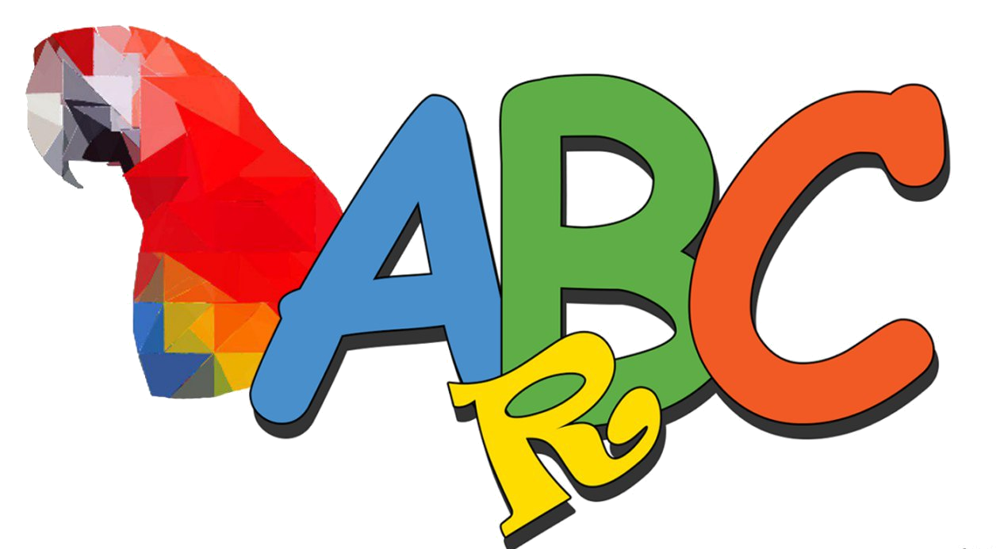
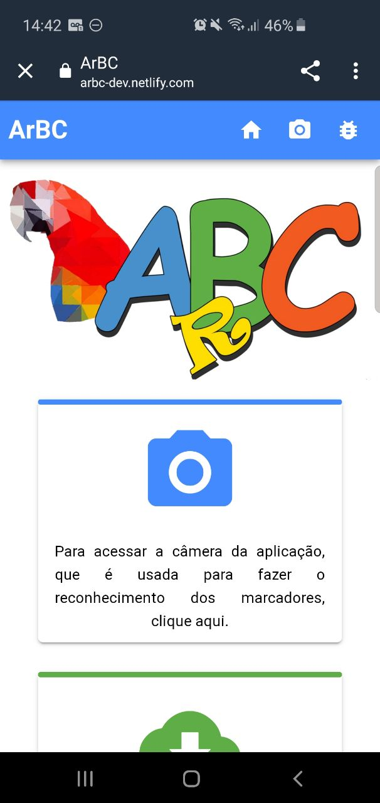
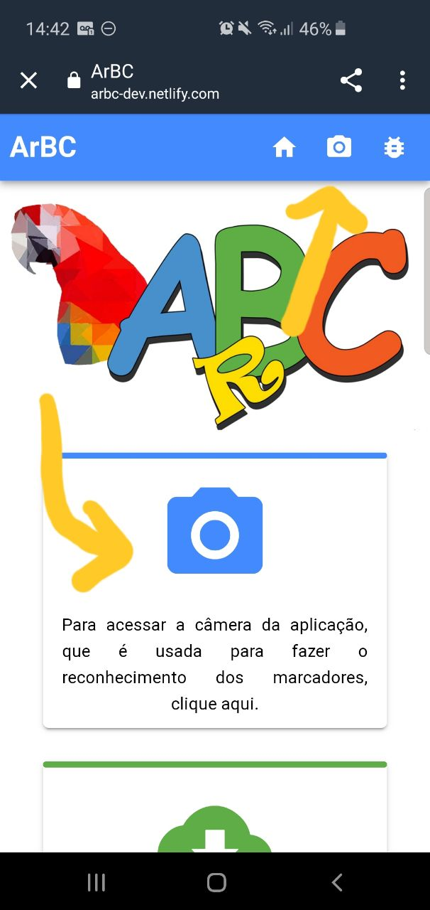
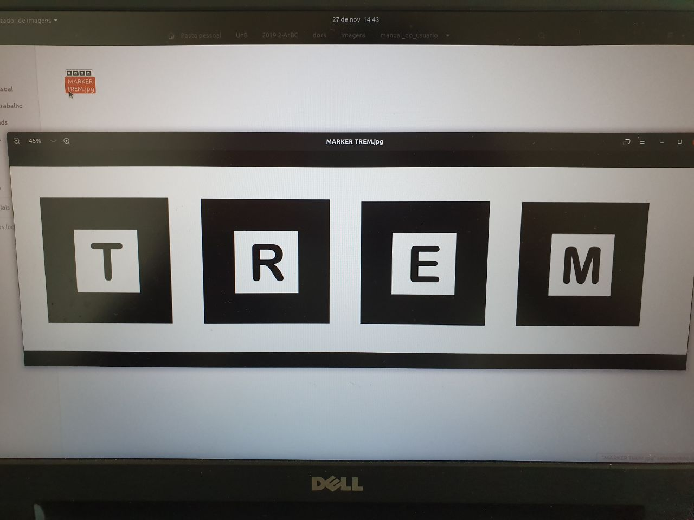
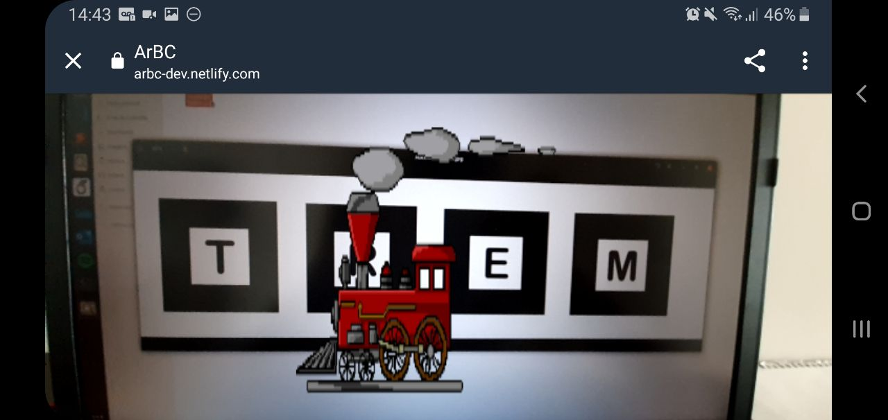

# Histórico de Versões

Data|Versão|Descrição|Autor
-|-|-|-
26/11|1.0.0|Adição do template do Documento| Sérgio Cipriano|
26/11|1.1.0|Adição dos tópicos 1 e 2| Marcelo Victor|
26/11|1.2.0|Adição dos tópicos 3 e 4| Marcelo Victor|
27/11|1.3.0|Recriando o tópico 1| Sérgio Cipriano|
27/11|1.4.0|Recriando o tópico 2| Sérgio Cipriano|
27/11|1.5.0|Melhorando tópicos 3 e 4| Sérgio Cipriano|
27/11|1.5.1|Correção de erros ortográficos e semânticos| Sérgio Cipriano|

# Sumário

1. [Introdução](#1)
  - 1.1 [O que é o ArBC](#1_1)
2. [Usuários](#2)
  - 2.1 [Papel do professor](#2_1)
  - 2.2 [Como guiar a criança](#2_2)
3. [Funcionalidades](#3)
  - 3.1 [Usando marcadores para mostrar um gif](#3_1)
  - 3.2 [Adicionando novos gifs](#3_2)
4. [Passo a Passo](#4)
5. [Como nos contactar](#5)
  - 5.1 [Membros do time](#5_1)
  - 5.2 [Informações adicionais](#5_2)
___

### 1. <a name="1">Introdução</a>

#### 1.1 <a name="1_1">O que é o ArBC</a>

 &emsp;&emsp; O ArBC é um software com intuito de auxiliar na alfabetização de crianças por meio da tecnologia de realidade aumentada. Com nossa aplicação, a criança terá um experiência mais lúdica e interativa ao tentar aprender palavras novas. Isso porque, com a realidade aumentada, conseguimos fazer atividades simples se tornarem visualmente muito mais interessantes.

 &emsp;&emsp; O nome ArBC surgiu de uma junção entre Ar (realidade aumentada, do inglês "augmented reality") e ABC, que simboliza a alfabetização. Além disso, a ideia do projeto surgiu a partir do Jandig, um software de realidade aumentada criado também dentro da UnB/FGA, que inclusive nos auxiliou quando precisamos. Por fim, sobre a representação visual do nosso produto, temos a arara, que foi escolhida para ser nosso mascote tendo em vista a biodiversidade brasileira, como também o fato de apresentar um leque de cores vivas e chamativas, que consideramos ideal para chamar atenção de uma criança.

 &emsp;&emsp; Na nossa aplicação temos 2 peças fundamentais para o funcionamento: um dispositivo com câmera e acesso à internet e os marcadores, que são nossas letras. Tendo isso em mãos já é possível aproveitar 100% do que oferecemos. Assim, basta combinar os marcadores para montar palavras e apontar a câmera para ver o que cada palavra representa. 

### 2. <a name="2">Usuários</a>

#### 2.1 <a name="2_1">Papel do professor</a>

 &emsp;&emsp; O professor possui, sem dúvidas, o papel mais importante no ArBC. Quando estávamos fazendo testes nos gifs e no reconhecimento das palavras nos veio uma pergunta "Como vamos fazer o controle dos gifs que entram na aplicação?". Pode não parecer, a primeiro momento, mas essa é uma questão difícil de se responder, já que envolve muitas variáveis.

 &emsp;&emsp; A princípio, pensamos em dar poder para qualquer pessoa se cadastrar na aplicação, mas como não tinhamos como criar um sistema que validasse se a palavra e o gif seguiam valores adequados para uma criança ter acesso, decidimos restringir esse poder apenas para os professores.

 &emsp;&emsp; Assim, por esse motivo, o professor possui grande atuação na aplicação. Além de ser um dos responsáveis por guiar a criança nesse processo de aprendizagem, será responsável por adicionar novos gifs e palavras na aplicação. Desse modo, para ter acesso à essas funcionalidades, designadas ao educador, basta entrar em contato que nós daremos todo o suporte e informações necessários para prosseguir.

 &emsp;&emsp; Pode parecer burocrático, mas esse controle é fundamental para garantir que a criança não tenha acesso a nenhum conteúdo impróprio.

#### 2.2 <a name="2_2">Como guiar a criança</a>

 &emsp;&emsp; O professor, os pais ou responsáveis podem desenolver atividades que envolvam o ArBC, como um caça palavras interativo, por exemplo, ou podem simplesmente utilizar seguindo nosso escopo da aplicação. Independente da metodologia utilizada para alfabetizar, é fundamental que o uso do software seja acompanhado de um responsável que guiará a criança no caminho correto.

### 3. <a name="3">Funcionalidades</a>

#### 3.1 <a name="3_1">Usando marcadores para mostrar um gif</a>

 &emsp;&emsp; Para aparecer o gif desejado é muito simples. Ordene os marcadores de forma que represente uma palavra, alinhada, já cadastrada no banco de dados e aponte a câmera do aparelho eletrònico para os marcadores. Apenas com isso já será possivel visualizar os gifs. 

#### 3.2 <a name="3_2">Adicionando novos gifs</a>

 &emsp;&emsp; Para adicionar novos gifs, o professor ou responsável que tenha sido autorizado, acessará a tabela de palavras e colocará no campo nome a palavra e no campo de imagem o gif que representa a palavra. É recomendável que o gif seja transparente, assim fará com que o efeito de "sair da tela" seja mais evidente. Além disso, quanto menor o tamanho do gif menos será exigido do aparelho eletrônico.

### 4. <a name="4">Passo a passo</a>

> Abrir o ArBC

[ArBC](https://arbc.netlify.com/) 

> Acessar a Câmera

> Apontar para os marcadores alinhados

> Pronto, o GIF irá aparecer

### 5. <a name="5">Como nos contactar</a>

#### 5.1 <a name="5_1">Membros do time</a>

A equipe de gestão do projeto tem como representantes: 

Gestores|Email
|:-|:-:| 
|Eduardo Lima|eduardolimrib@gmail.com|
|Luciano dos Santos|Luciano_z7@hotmail.com|
|João Lucas|joao.lucas.ssr@gmail.com|

A equipe de desenvolvimento tem como representantes: 

Programadores|Email
|:-|:-:| 
|Igor Batista|igorbatistapaiva@outlook.com|
|João Paulino|joao.henrique1299@gmail.com|
|Marcelo Victor|marcelovictorg2@gmail.com|
|Rhuan Carlos|rhuancarlos.queiroz@gmail.com|
|Sérgio Cipriano|sergiosacj@hotmail.com.br|
|Thiago Lopes|thiago.lopes.santos.tls@gmail.com|

#### 5.2 <a name="5_2">Informações adicionais</a>

*Wiki:*
> https://jlucassr.github.io/ArBC-Pages/

*Repositório Front-End*
> https://github.com/fga-eps-mds/2019.2-ArBC

*Repositório Back-End*
> https://github.com/fga-eps-mds/2019.2-ArBC-API